# Mobile Games

This repository contains a collection of mobile games I developed using **Unity 3D** between **2017 and 2019**.

These games were originally published on both the **Google Play Store** and **Apple App Store**.  
As I no longer actively maintain them on official platforms, I have made the **APK files available for download** here for anyone interested in trying them.

 

<!-- Balls Winning -->
<table>
  <tr>
    <td></td>
    <td style="padding-left: 10px;"><a href="apks/ballswinning.apk"><strong>Balls Winning</strong></a></td>
  </tr>
</table>
<table>
  <tr>
    <td></td>
    <td></td>
    <td><a href="images/screen/ballswinning/3.png">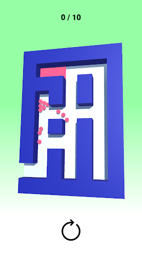</a></td>
  </tr>
</table>
 

---

<!-- Epic Slice -->
<table>
  <tr>
    <td></td>
    <td style="padding-left: 10px;"><a href="apks/epicslice.apk"><strong>Epic Slice</strong></a></td>
  </tr>
</table>
<table>
  <tr>
    <td></td>
    <td><a href="images/screen/epicslice/2.png">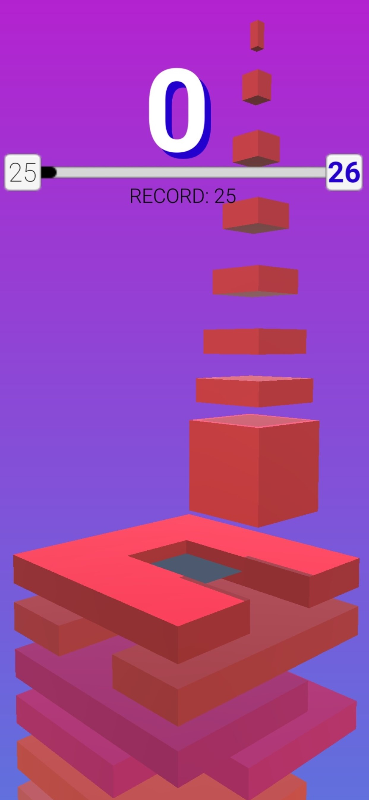</a></td>
    <td></td>
  </tr>
</table>
 

---

<!-- Free Fall -->
<table>
  <tr>
    <td>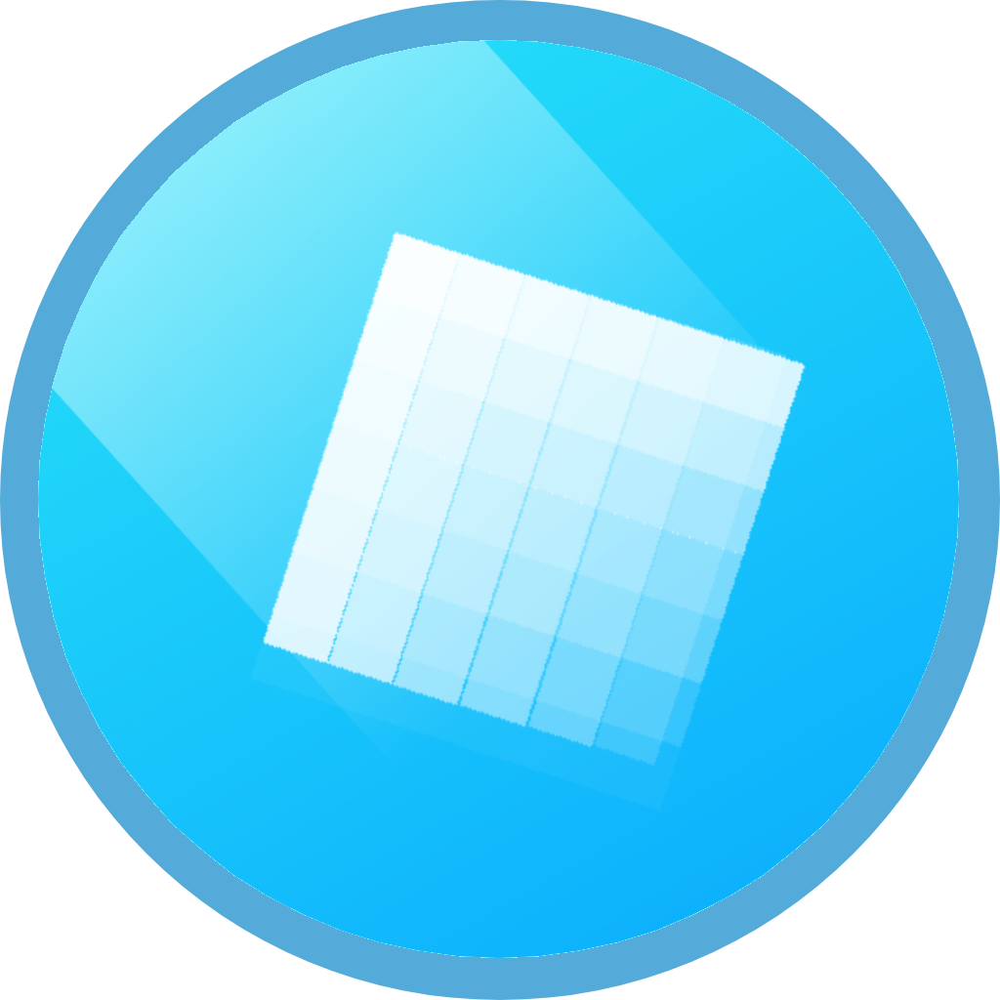</td>
    <td style="padding-left: 10px;"><a href="apks/frefall.apk"><strong>Free Fall</strong></a></td>
  </tr>
</table>
<table>
  <tr>
    <td></td>
    <td><a href="images/screen/frefall/2.png">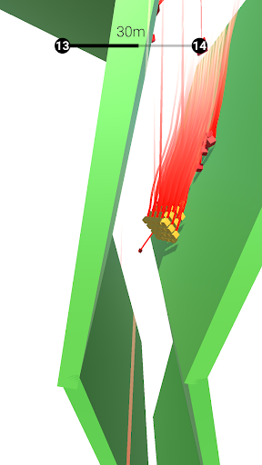</a></td>
    <td><a href="images/screen/frefall/3.png">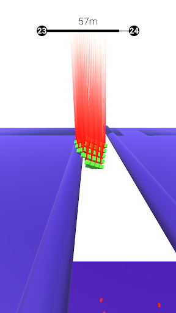</a></td>
  </tr>
</table>
 

---

<!-- Replendum -->
<table>
  <tr>
    <td></td>
    <td style="padding-left: 10px;"><a href="apks/replendum.apk"><strong>Replendum</strong></a></td>
  </tr>
</table>
<table>
  <tr>
    <td></td>
    <td></td>
    <td></td>
  </tr>
</table>
 

---

<!-- Skewer -->
<table>
  <tr>
    <td></td>
    <td style="padding-left: 10px;"><a href="apks/skewer.apk"><strong>Skewer</strong></a></td>
  </tr>
</table>
<table>
  <tr>
    <td><a href="images/screen/skewer/1.png">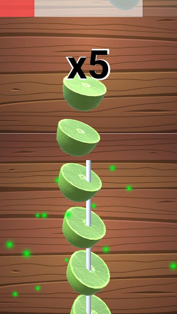</a></td>
    <td></td>
    <td></td>
  </tr>
</table>
 

---

<!-- Tic Stack -->
<table>
  <tr>
    <td>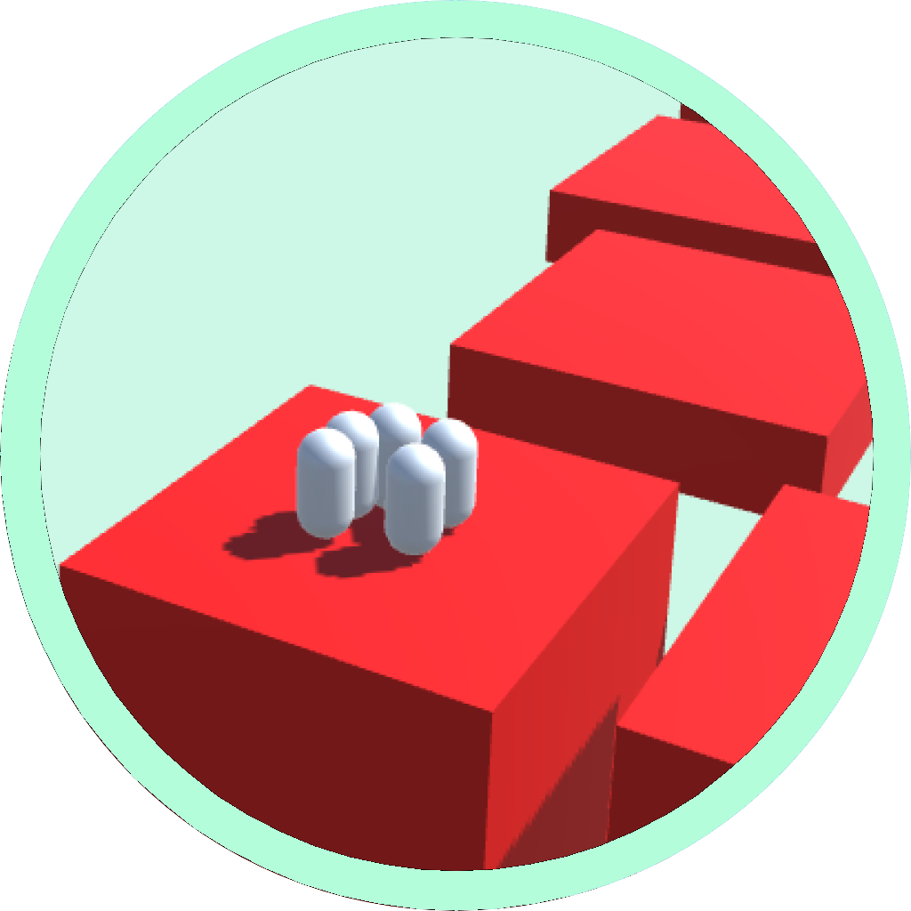</td>
    <td style="padding-left: 10px;"><a href="apks/ticstack.apk"><strong>Tic Stack</strong></a></td>
  </tr>
</table>
<table>
  <tr>
    <td></td>
    <td><a href="images/screen/ticstack/2.png">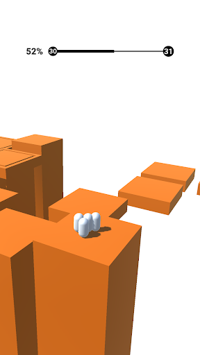</a></td>
    <td><a href="images/screen/ticstack/3.png">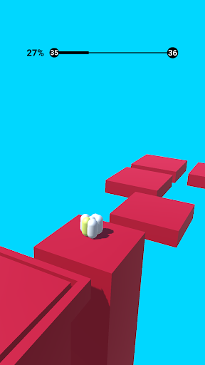</a></td>
  </tr>
</table>
 

---

<!-- Tri Lines -->
<table>
  <tr>
    <td>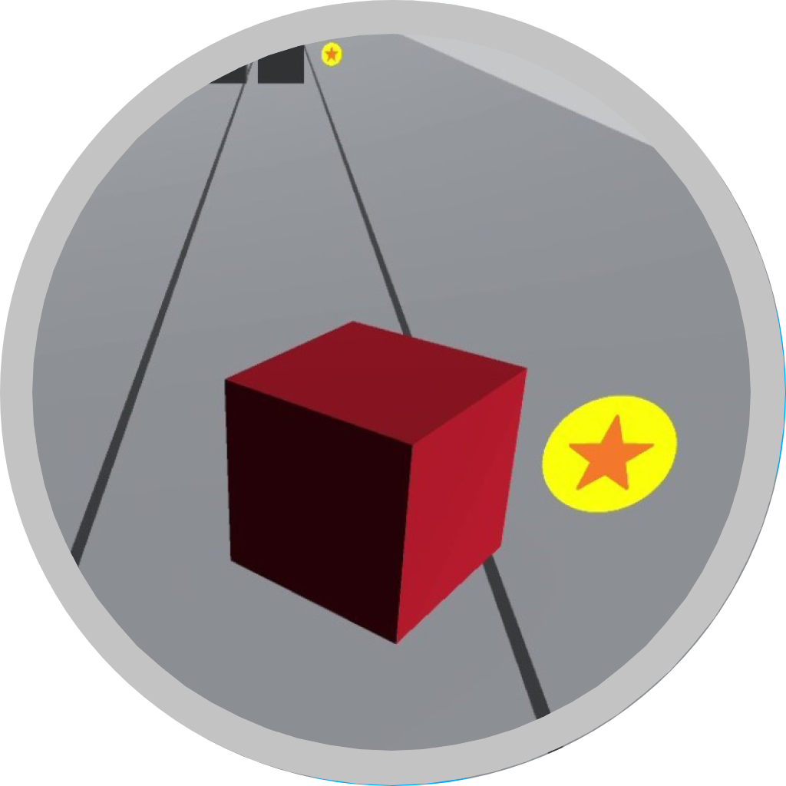</td>
    <td style="padding-left: 10px;"><a href="apks/trilines.apk"><strong>Tri Lines</strong></a></td>
  </tr>
</table>
<table>
  <tr>
    <td></td>
    <td><a href="images/screen/trilines/2.png">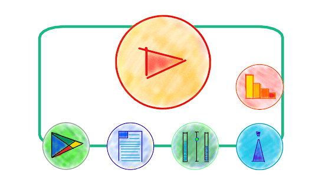</a></td>
    <td><a href="images/screen/trilines/3.png">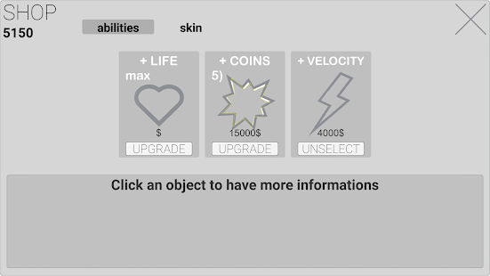</a></td>
  </tr>
</table>
 

---

## How to Install

Click on a game title to download the APK.  
Enable **installation from unknown sources** on your Android device.

---
